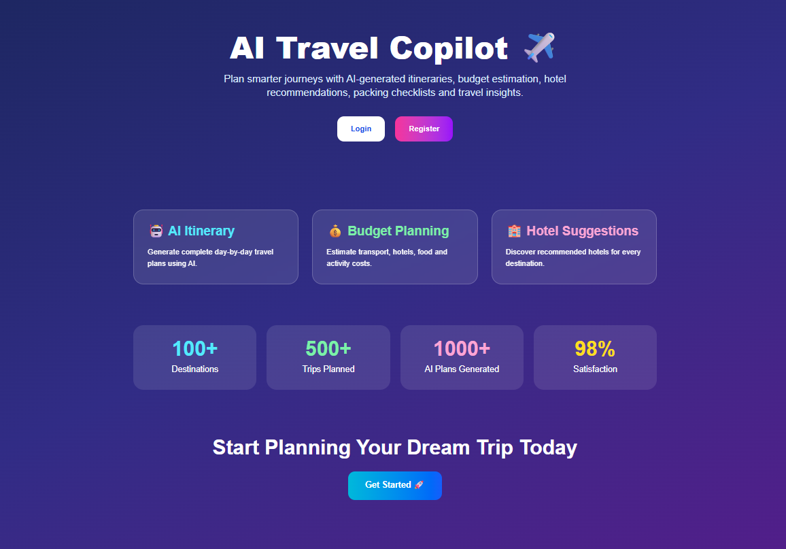
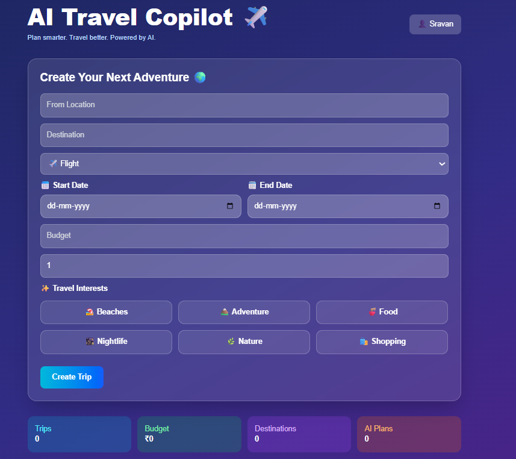

# AI Travel Copilot ✈️

AI Travel Copilot is a full-stack AI-powered travel planning application that helps users create trips, generate smart itineraries, estimate travel budgets, discover hotels, and get personalized travel recommendations using Google Gemini AI.

---

## Features

### Authentication

* User Registration
* User Login
* JWT Authentication
* Protected Routes

### Trip Management

* Create Trips
* Edit Trips
* Delete Trips
* View Trip Details

### Smart Travel Planning

* Source Location Selection
* Destination Selection
* Travel Mode Selection

  * Flight
  * Train
  * Bus
  * Car
* AI Generated Travel Itinerary

### AI Features

* Day-by-Day Travel Plans
* Budget Estimation
* Hotel Recommendations
* Travel Tips
* Packing Checklist

### User Experience

* Modern Glassmorphism UI
* Responsive Design
* User Profile Dashboard
* PDF Export

---

## Tech Stack

### Frontend

* Next.js 16
* TypeScript
* Tailwind CSS
* Axios
* React Hot Toast

### Backend

* Node.js
* Express.js
* MongoDB
* Mongoose
* JWT Authentication

### AI

* Google Gemini API

---

## Project Structure

```txt
ai-travel-copilot/
│
├── frontend/
│   ├── app/
│   ├── components/
│   └── services/
│
├── backend/
│   ├── controllers/
│   ├── routes/
│   ├── models/
│   ├── middleware/
│   └── services/
│
└── README.md
```

---

## Installation

### Clone Repository

```bash
git clone YOUR_GITHUB_REPOSITORY_URL
```

---

### Backend Setup

```bash
cd backend

npm install

npm run dev
```

Create `.env`

```env
PORT=5000

MONGO_URI=your_mongodb_connection

JWT_SECRET=your_secret_key

GEMINI_API_KEY=your_gemini_api_key
```

---

### Frontend Setup

```bash
cd frontend

npm install

npm run dev
```

Create `.env.local`

```env
NEXT_PUBLIC_API_URL=http://localhost:5000/api
```

---

## Screenshots

### Landing Page



### Dashboard



### AI Generated Itinerary


---

## Future Enhancements

* Weather Forecast Integration
* Google Maps Integration
* Real Hotel APIs
* Flight Booking APIs
* Expense Tracker
* Multi-City Trip Planning

---

## Author

Sravan Kumar

AI Travel Copilot - 2026
